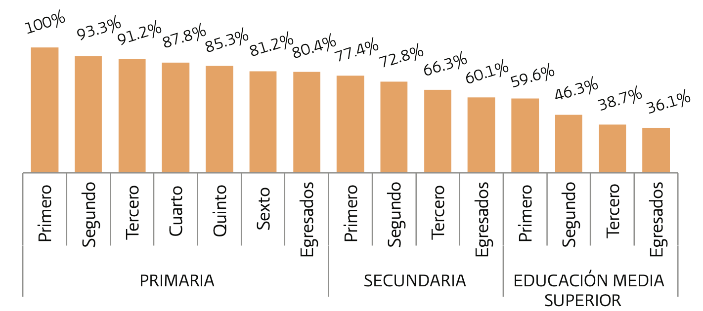

# Introducción

---

Para entender el objeto de este estudio es necesario que demos una descripción muy precisa de lo que es la deserción escolar.

Deserción escolar
: "el total de alumnos que abandonan las actividades escolares antes de concluir un grado o nivel educativo"

Es decir, para cuantificar la deserción, se deberá contabilizar a los individuos que ya una vez inscritos en algún grado escolar, abandonan los estudios parcial o completamente.  ^[Lineamientos para la elaboración de indicadores educativos]

De esta manera la Deserción escolas total se puede calcular como la suma de la deserción intercurricular y la deserción intracurricular. 

* La deserción intracurricular se refiere al abandono escolar que se presenta en el interior de un ciclo escolar; es decir, mientras el programa de estudios se está desarrollando. En esta vertiente, el alumno no concluye el ciclo escolar al que se inscribió.

 * En cambio, la deserción intercurricular se presenta en el intermedio de dos ciclos escolares; es decir, ocurre cuando un alumno concluye un ciclo escolar y no se inscribe al siguiente, independientemente de si aprobó o no.
 
 {width=80%}
 
 De manera general para el caso Mexicano se puede observar el siguiente escenario:
 
{width=100%}

De 100 alumnos inscritos en primaria, 60 concluyeron la secundaria, y 36 terminaron el bachillerato.

En términos prácticos un desertor es:

"Aquella persona que inició el grado o el nivel educativo correspondiente, no lo concluyó y no se encuentra realizando estudios para alcanzar dicha conclusión"

   
   
