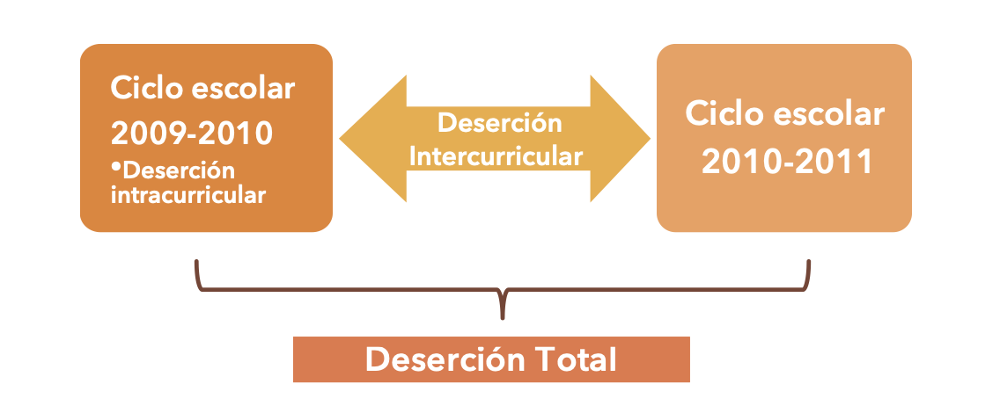
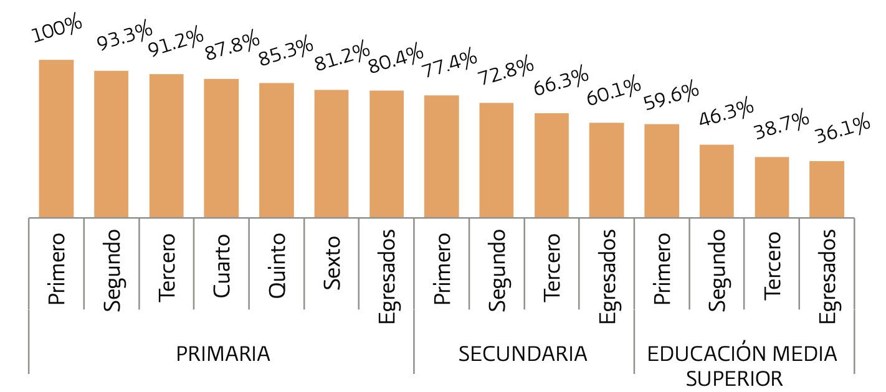

---


# Prefacio {-}

---

```{r, setup, include=FALSE}

knitr::opts_chunk$set(cache = TRUE, warning = FALSE, message = FALSE, echo = TRUE, dpi= 180, fig.width = 8, fig.height = 5)


library(dplyr)
library(tidyr)
library(openxlsx)
library(haven)
library(stringr)
library(ggplot2)
library(tidymodels)
library(skimr)
library(xgboost)

```


> "La comprensión se utiliza con más frecuencia para tratar de alterar el resultado que para repetirlo o perpetuarlo "
>
> --- Jared Diamond

Este documento tiene la finalidad utilizar **aprendizaje de máquina** para identificar y predecir la frecuencia de factores que condicionan la deserción en la educación media. Toma como eje el trabajo publicado en 2012, denominado "Reporte de la Encuesta Nacional de Deserción en la Educación Media Superior" el cual es la única encuesta en este país para intertar entender cuál es la razón de la deserción escolar.


Consiste en 13,014 entrevistas realizadas a 6,472 mujeres y 6,542 hombres, de estas entrevistas 4,770 jóvenes nunca se matricularon en el nivel medio superior y 2,549 desertaron; el resto, 5,686 continúan estudiando o concluyeron este nivel.

**Cobertura geográfica.**

La cobertura geográfica es representativa a nivel nacional de viviendas particulares en localidades con más de 500 habitantes.

**Periodo de referencia.**

Del 25 de junio al 30 de julio de 2011.

**Población de Interés.**

Existen una población de interés y 3 subpoblaciones.

{width=100%}

**1.** Los desertores: aquellos jóvenes que iniciaron la Educación Media Superior y al momento de la entrevista no la habían concluido ni se encontraban realizando estudios para concluir este nivel educativo.
**2.** Los no desertores: aquellos estudiantes que iniciaron la Educación Media Superior y al momento de la entrevista: a) ya la habían terminaron, o b) no la habían terminado pero seguían estudiando para completarla.
**3.** Los no matriculados: aquellos jóvenes que al momento de la entrevista no estaban inscritos en la Educación Media Superior, ya sea porque seguían estudiando y todavía no terminaban la secundaria o porque no estaban estudiando y abandonaron sus estudios en algún momento anterior a la media superior.


El tamaño de muestra se fijó en 2,000 desertores, para lo cual se estimó necesario visitar 44,000 viviendas. De esta forma, se aprovechó también el número de visitas para recabar informacíon de jóvenes que nunca se inscribieron a la Educación Media Superior, ya sea porque seguían estudiando la secundaria, porque desertaron del sistema educativo mientras estudiaban la Educación Básica o porque concluyeron ese nivel y no transitaron al siguiente.

El esquema de muestreo fue **probabilista**, **estratificado**, por **conglomerados** y **polietápioc*o. La población objetivo de la ENDEMS estuvo compuesta por jóvenes, hombres y mujeres, de entre 14 y 25 años de edad que residían permanentemente en viviendas particulares ubicadas en localidades con más de 500 habitantes dentro del territorio nacional

La ENDEMS es la primera encuesta que se levanta en México específicamente sobre deserción en la Educación Media Superior y que es representativa a nivel nacional. 


<!--chapter:end:index.Rmd-->

# Introducción

---

Para entender el objeto de este estudio es necesario que demos una descripción muy precisa de lo que es la deserción escolar.

Deserción escolar
: "el total de alumnos que abandonan las actividades escolares antes de concluir un grado o nivel educativo"

Es decir, para cuantificar la deserción, se deberá contabilizar a los individuos que ya una vez inscritos en algún grado escolar, abandonan los estudios parcial o completamente.  ^[Lineamientos para la elaboración de indicadores educativos]


De esta manera la Deserción escolas total se puede calcular como la suma de la deserción intercurricular y la deserción intracurricular. 

* La deserción intracurricular se refiere al abandono escolar que se presenta en el interior de un ciclo escolar; es decir, mientras el programa de estudios se está desarrollando. En esta vertiente, el alumno no concluye el ciclo escolar al que se inscribió.

 * En cambio, la deserción intercurricular se presenta en el intermedio de dos ciclos escolares; es decir, ocurre cuando un alumno concluye un ciclo escolar y no se inscribe al siguiente, independientemente de si aprobó o no.
 
 {width=80%}
 
 De manera general para el caso Mexicano se puede observar el siguiente escenario:
 
{width=100%}

De 100 alumnos inscritos en primaria, 60 concluyeron la secundaria, y 36 terminaron el bachillerato.

En términos prácticos un desertor es:

"Aquella persona que inició el grado o el nivel educativo correspondiente, no lo concluyó y no se encuentra realizando estudios para alcanzar dicha conclusión"


   
   

<!--chapter:end:01-introduccion.Rmd-->

# Carga de Datos

---

Este apartado carga los datos y examina los principales estadísticos que se presentaron en la encuesta.

Lo primero que se tuvo que hacer fue modificar la encuesta ya que su unidad básica era el hogar, por ello se tuvieron que trabajar los datos para colocarlos por población objetivo, es decir aquelos jóvenes entre 14 y 21 años que habìna deseratdo de la educación media superior.

Al hacer esto nos encotramos con una base de **12,317** adolescentes que fueron entrevistados (diferentes a las 13,014 viviendas en las que se habia aplicado la encuesta)

```{r}
# Es importante que se habra con el encoding porque corrige los acentos.
encuesta <- read_dta('./Data/base_abandono.dta', encoding= "Latin1")

```

Una vez cargada la encuesta, encontramos que no estaba codificada por ello, tomamos todos los datos y construimos los factores, haciendo más manejable la encuesta, cabe señalar que esta parte del trabajo tomó mucho timepo ya que se codificaron las variables a factores.

Como puede ver a continuación algunos de los nombres de las columnas eran de clase *"haven_labelled"* por esta razón se procedió a cambiarlos a factor junto con otras, 114 variables.

```{r}
head(encuesta,4)

class(encuesta$edad)

```

A continuaciónse correrán los Script de **R** diseñados colocar los nombres de los estads y los municipios.
```{r}
source("clave_edo_mun.R")
```


El siguiente Script cambia todas las variables *havel_labelled* a *factor*.
```{r}
source("clave_preg.R")
```


<!--chapter:end:02-Datos.Rmd-->

# Estadísticos descriptivos del Abandono Escolar

Empezaremos este ejercicio dividiendo nuestra encuesta, en dos set de datos uno para el entrenamiento y otro para la prueba, por ese motivo decidimos separa la base usando un muestreo estratificado debido a que las muestra no es balanceada.

Decidimos guardar **20%** como datos de prueba, siendo **2,464** y usar el restante **9,853** como datos de entrenamiento, de estos usar el **20%** de los datos de entrenamiento para hacer validación, quedando como sigue:

|Division|Total|Porcentaje|
|---|---|---|
|Prueba|2,464|20%|
|Entrenamiento|9,853|80%|
|Total|12,317|100%|

Posteriormente la muestra de entrenamiento se subdivide, para crear espacio para la muestra de validación.

|Division|Total|Porcentaje|
|---|---|---|
|Entrenamiento|7,882|80%|
|Validación |1,971|20%|
|Total |9,853|100%|
<7882/1971/9853>


```{r}
set.seed(2021)


encuesta_part_inicial <- initial_split(encuesta, strata = desertor, prop = 0.80)
encuesta_total <- training(encuesta_part_inicial)
encuesta_part_val <- validation_split(encuesta_total, prop = 0.80)
encuesta_part_val$splits


```

### Limpieza, exploración y análisis conceptual

Primero vamos a establecer que la variable desertor es la que estamos buscando, esta toma dos valores, 1 si el estudiante desertó y 0 si no lo hizo.

Podemos observar que se cuenta con 32% de desertores y 68% no desertores en la encuesta.
 

```{r}
set.seed(2021)
entrena <- training(encuesta_part_val$splits[[1]])
nrow(entrena)
entrena%>% count(desertor) %>%
  mutate(pcn = round(n / sum(n),2))
```

### Resumen general

```{r}
library(skimr)

skim(entrena)

```

### ¿El género influye?

En la siguiente tabla puede ver que parecen ser números muy similares, es decir, se observa que mientras el 33% de los hombres desertan, el 31% de las mujeres lo hacen.

Incluso pensaría que el porcentaje de mujeres que sería superior pero los datos indican lo cotrario, la tasa de deserción de mujeres es ligeramente menor que la de los hombres.

```{r}
entrena %>% select(sexo, desertor) %>% 
  group_by(sexo, desertor) %>% 
  tally() %>% mutate(pcn = round(n/sum(n),2))

```


### Entendiendo la Edad

Se puede observar un aumento de la deserción conforme aumenta la edad. Esto es comprenseible, porque conforme pasan los años, las personas tienen menos oportunidades de regresar a continuar con sus estudios.

```{r}
entrena %>% select(edad, desertor) %>% 
  group_by(edad, desertor) %>% 
  tally() %>% mutate(pcn = round(n/sum(n),2)) %>%
  ggplot(aes(factor(edad), pcn, fill = desertor)) + 
  geom_col(position = "dodge") + scale_y_continuous(labels = scales::percent_format())


datos_entrena<- entrena %>% select(edad, desertor) %>% 
  group_by(edad, desertor) %>% 
  tally() %>% mutate(pcn = round(n/sum(n),2)) 
write_xlsx(datos_entrena, "desertores_edad.xlsx")
sum(datos_entrena$n)
```

##  Variables claramente importantes (hipótesis):

- lead time (cuánto tiempo de anticipación en la reserva), 
- Sexo 
- Tiempo de la escuela a la casa
- Tener hijos
- Consumo de Drogas


```{r}
tabla_univariada <- function(datos, variable, target){
  datos %>% count({{ variable }}, {{ target }}) %>% group_by({{ variable }}) %>% 
  mutate(prop = n / sum(n)) %>% mutate(prop = round(prop, 2)) }

tabla_univariada(encuesta, p5, desertor)
```

```{r}

```
```{r}
encuesta %>% filter(edad > 17)
```

```{r}


```

```{r}

```


<!--chapter:end:03-EDA.Rmd-->

# Preprocesamiento e ingenieria de entradas:


Usaremos una receta más simple (no necesariamente tenemos que poner interacciones,
categorización de entradas, transformaciones no lineales):
```{r}
entrena %>% names
```


```{r}
receta <-   recipe(desertor ~ edo +
                              muni +  
                              edad + 
                              sexo + 
                              p5 + 
                              p6 +   
                              p7 +    
                              p9_1:p9_12 +    
                              p10 +
                              p12_1:p12_10 +
                              p14 +    
                              p15 +  
                              p16 +  
                              p17 +   
                              p18 +   
                              p23_1:p23_2 + 
                              p25_1:p25_23 +   
                              p27 +     
                              p39 +    
                              p40_1:p40_15 +  
                              p41a:p41i,
                       data = entrena) %>%
  step_dummy(all_nominal_predictors()) %>%
  step_zv(all_predictors()) #step_zv  remove variables that contain only a single value.
```

Dimensión de los datos:

```{r}
prep(receta, entrena) %>% juice() %>% dim()
```


Empezamos con parámetros más o menos default

```{r}
modelo_boosting <- boost_tree(learn_rate = 0.1, trees = 3000, 
                              mtry = 5, tree_depth = 3, sample_size = 0.8) %>%
  set_mode("classification") %>% 
  set_args(objective = "binary:logistic")
flujo <- workflow() %>% add_recipe(receta) %>% add_model(modelo_boosting)
flujo_fit <- fit(flujo, entrena)
```

```{r}
ajuste_xgboost <- flujo_fit %>% extract_fit_engine() %>% pluck("evaluation_log") %>%
  as_tibble()
ggplot(ajuste_xgboost, aes(x=iter, y = training_logloss)) + geom_line()
```


```{r}
valida <- testing(encuesta_part_val$splits[[1]])
preds_val <- predict(flujo_fit, valida, type = "prob") |> 
  bind_cols(valida |> select(desertor))
```


```{r}
mis_metricas <- metric_set(mn_log_loss, roc_auc)
mis_metricas(preds_val, truth = factor(desertor), .estimate = .pred_desertor, event_level = "first")
```

```{r}
preds_entrena <- predict(flujo_fit, entrena, type = "prob") %>% 
  bind_cols(entrena %>% select(desertor))
```


```{r}
mis_metricas <- metric_set(mn_log_loss, roc_auc)
mis_metricas(preds_entrena, truth = factor(desertor), .estimate = .pred_desertor, event_level = "first")
```
```{r}
ggplot(preds_val, aes(x = .pred_desertor, fill = factor(desertor))) + 
  geom_histogram()
```


### Preparar solución
# NO sé como hacer esto


```{r}
encuesta_test  <-  testing(encuesta_part_inicial)

preds_prueba_sol <- predict(flujo_fit, encuesta_test, type="prob") %>% 
  bind_cols(encuesta_test %>% select(desertor)) %>%
  select(desertor, prob = .pred_desertor)
  
### No sale
#mis_metricas(preds_prueba_sol, truth = factor(desertor), .estimate = #.pred_desertor, event_level = "first")
```

**Resultados**:

1. Esto modelo logra un score de 0.385
2. Afina para llegar a 0.375, que fue el score ganador del concurso.

<!--chapter:end:04-modelo_xgboost.Rmd-->

