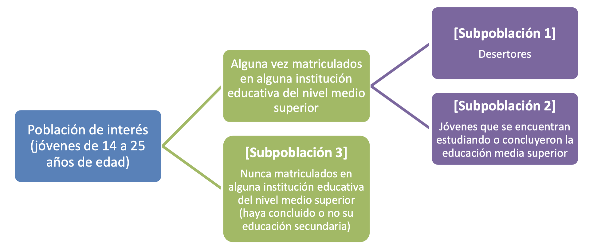

---


# Prefacio {-}

---

```{r, setup, include=FALSE}

knitr::opts_chunk$set(cache = TRUE, warning = FALSE, message = FALSE, 
                      echo = TRUE, dpi= 180, fig.width = 8, fig.height = 5)


library(dplyr)
library(tidyr)
library(openxlsx)
library(haven)
library(stringr)
library(ggplot2)
library(tidymodels)
library(skimr)
library(xgboost)

```


> "La comprensión se utiliza con más frecuencia para tratar de alterar el resultado que para repetirlo o perpetuarlo "
>
> --- Jared Diamond

Este documento tiene la finalidad utilizar **aprendizaje de máquina** para identificar y predecir la frecuencia de factores que condicionan la deserción en la educación media. Toma como eje el trabajo publicado en 2012, denominado "Reporte de la Encuesta Nacional de Deserción en la Educación Media Superior" el cual es la única encuesta en este país para intertar entender cuál es la razón de la deserción escolar.


Consiste en 13,014 entrevistas realizadas a 6,472 mujeres y 6,542 hombres, de estas entrevistas 4,770 jóvenes nunca se matricularon en el nivel medio superior y 2,549 desertaron; el resto, 5,686 continúan estudiando o concluyeron este nivel.

**Cobertura geográfica.**

La cobertura geográfica es representativa a nivel nacional de viviendas particulares en localidades con más de 500 habitantes.

**Periodo de referencia.**

Del 25 de junio al 30 de julio de 2011.

**Población de Interés.**

Existen una población de interés y 3 subpoblaciones.


 
{width=100%}


**1.** Los desertores: aquellos jóvenes que iniciaron la Educación Media Superior y al momento de la entrevista no la habían concluido ni se encontraban realizando estudios para concluir este nivel educativo.

**2.** Los no desertores: aquellos estudiantes que iniciaron la Educación Media Superior y al momento de la entrevista: a) ya la habían terminaron, o b) no la habían terminado pero seguían estudiando para completarla.

**3.** Los no matriculados: aquellos jóvenes que al momento de la entrevista no estaban inscritos en la Educación Media Superior, ya sea porque seguían estudiando y todavía no terminaban la secundaria o porque no estaban estudiando y abandonaron sus estudios en algún momento anterior a la media superior.


El tamaño de muestra se fijó en 2,000 desertores, para lo cual se estimó necesario visitar 44,000 viviendas. De esta forma, se aprovechó también el número de visitas para recabar informacíon de jóvenes que nunca se inscribieron a la Educación Media Superior, ya sea porque seguían estudiando la secundaria, porque desertaron del sistema educativo mientras estudiaban la Educación Básica o porque concluyeron ese nivel y no transitaron al siguiente.

El esquema de muestreo fue **probabilista**, **estratificado**, por **conglomerados** y **polietáptico**. La población objetivo de la ENDEMS estuvo compuesta por jóvenes, hombres y mujeres, de entre 14 y 25 años de edad que residían permanentemente en viviendas particulares ubicadas en localidades con más de 500 habitantes dentro del territorio nacional.

La ENDEMS es la primera encuesta que se levanta en México específicamente sobre deserción en la Educación Media Superior y que es representativa a nivel nacional. 


